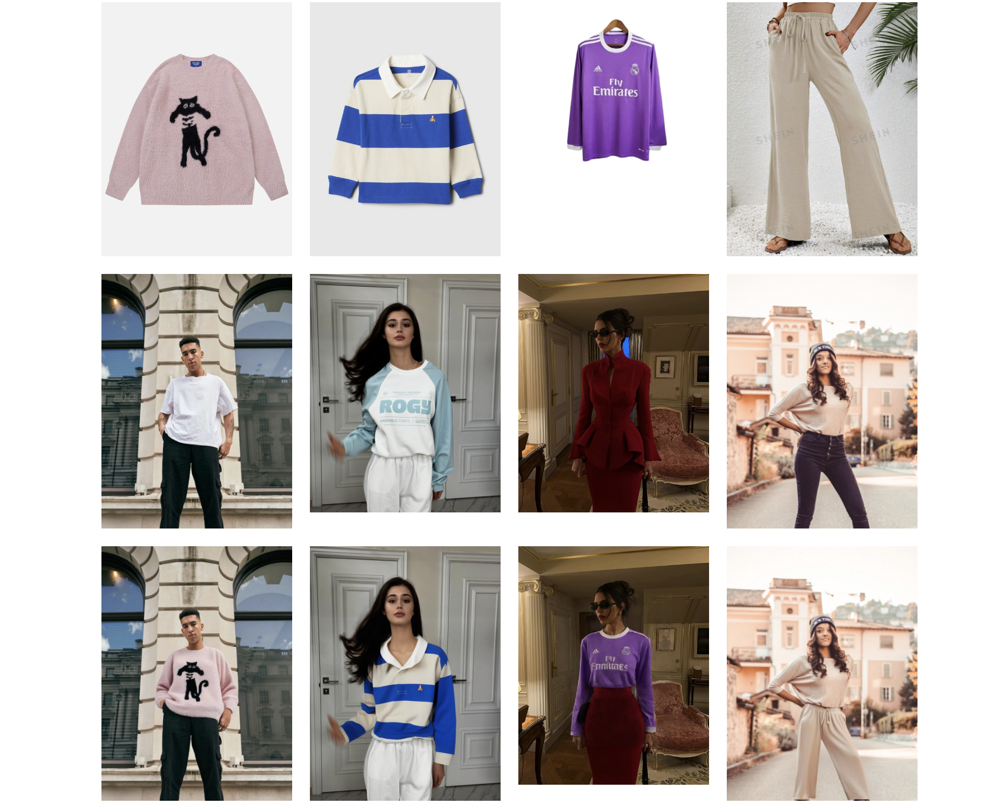

# [Try-On AI](https://ollayor.uz/try-on.ollayor.uz)

This project allows users to virtually try on garments using AI by uploading garment and human images.

[](https://try-on.ollayor.uz)

## Features

- Upload garment and human images
- Describe the garment
- View virtual try-on results
- Toggle visibility of the Replicate API token
- Display loading state and error messages

## Technologies Used
- React
- Next.js
- Chakra UI
- Replicate API
- Formidable for handling file uploads

## Getting Started

### Prerequisites

- Node.js (v14 or higher)
- npm or yarn

### Installation

1. Clone the repository:

   ```bash
   git clone https://github.com/olllayor/try-on
   cd try-on

2. Install dependencies:
    
    ```bash
    npm install
    # or
    yarn install

3. Running the APP

    ```bash
    npm run dev
    # or
    yarn dev

4. Open your browser and navigate to httt://localhost:3000

### CONTRIBUTING

Contributions are welcome! Please open an issue or submit a pull request for any improvements or bug fixes.

### LICENSE

This project is licensed under the MIT License.
